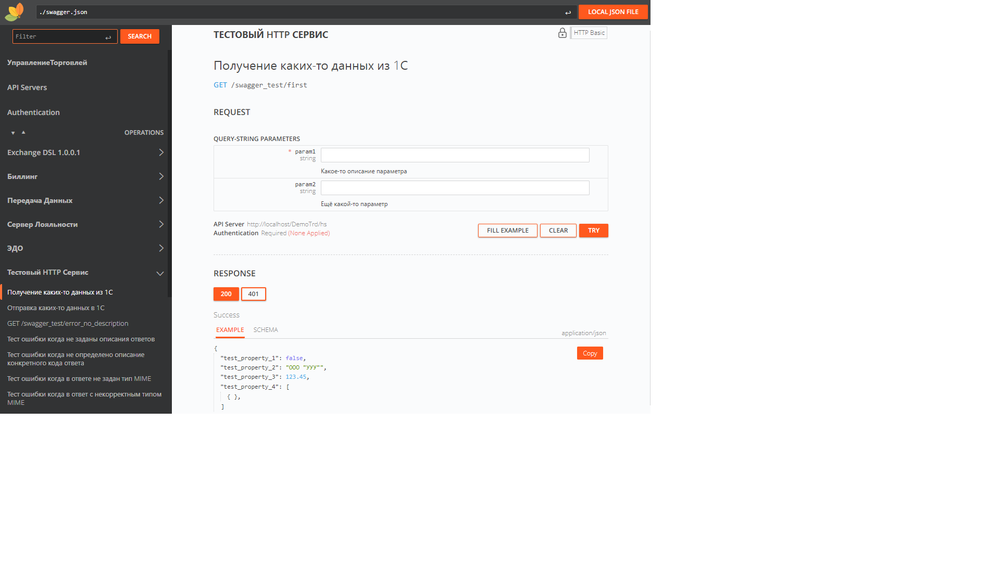

# Swagger для 1С:Предприятия 8

[](https://openyellow.org/grid?data=top&repo=304872931)

Данный продукт предназначен для организации процесса документирования HTTP сервисов конфигураций написанных на платформе 1С:Предприятие.


Кроме swagger-ui для визуализации API могут использоваться следующие решения:

<details>
  <summary>ReDoc</summary>
  
</details>

<details>
  <summary>Scalar</summary>
  
</details>

<details>
  <summary>Stoplight</summary>
  
</details>

<details>
  <summary>RapiDoc</summary>
  
</details>

Для того чтобы переключиться на желаемую библиотеку в строке запроса надо добавить параметр:
```
/swagger/index.html?ui=scalar
```

## Состав репозитория

+ swagger - расширение конфигурации реализующее функциональность создания документации
+ swagger-test - расширение для тестирования

## Порядок установки

В режиме конфигуратора создать расширение и выполнить загрузку конфигурации из файлов, указав при этом каталог swagger.

## Запуск

Опубликовать базу 1С:Предприятия на web-сервере. Обязательно проконтролировать, что cтоит настройка публикации "Публиковать HTTP сервисы расширений по умолчанию". Возможно после публикации или изменения настроек публикации потребуется перезапуск web-сервера. Открыть в браузере страницу http://<Адрес_опубликованной_базы_1С_Предприятия>/hs/swagger/index.html

## Создание описаний для своих HTTP сервисов

Поиск описаний происходит среди общих модулей. Наименование общего модуля должно быть построено по шаблону: "<Наименование_HTTP_сервиса>Описание".

Пример создания описания можно посмотреть:

+ swagger-test\CommonModules\SwagTest_Тестовый_HTTPСервисОписание
+ swagger-test\CommonModules\ПередачаДанныхОписание

## Проверка входящих (запросов) и исходящих (ответов)

Реализовано через вызов обёрток "ПроверитьПараметры" и "ПроверитьОтвет" соответственно.

Для проверки входящих параметров:

```BSL
РезультатПроверкиПараметров = Swag_ОбработкаHTTP.ПроверитьПараметры("SwagTest_Тестовый_HTTPСервис", "ТестовыйGET", Запрос);
Если Не ПустаяСтрока(РезультатПроверкиПараметров) Тогда
    Возврат Swag_ОбработкаHTTP.ПолучитьОтветОшибки(РезультатПроверкиПараметров, Истина);
КонецЕсли;
```

Для проверки ответа:

```BSL
Возврат Swag_ОбработкаHTTP.ПроверитьОтвет("SwagTest_Тестовый_HTTPСервис", "ТестовыйGET", Ответ);
```

| Функциональность                          | Статус        | Обсуждение |
| ----------------------------------------- |:-------------:| ---------- |
| Наличие описания в запросах               | Запланировано |            |
| Входящие параметры GET запросов           | Запланировано |            |
| Входящие параметры POST запросов          | Запланировано |            |
| Наличие описания в ответах                | Реализовано   |            |
| Наличие и соответствие кода ответа        | Реализовано   |            |
| Наличие и соответствие типа MIME в ответе | Реализовано   |            |
| Исходящие параметры                       | Запланировано |            |
| Статический swagger.json                  | В работе      | [Ссылка](https://github.com/zerobig/swagger-1c/issues/1) |
