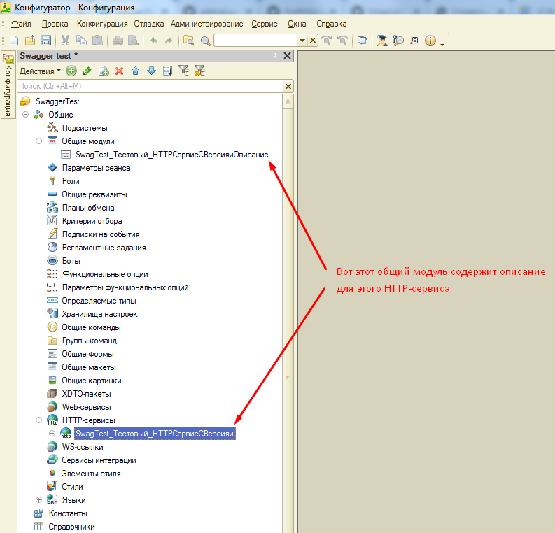

# Создание описаний для HTTP сервисов

Поиск описаний происходит среди общих модулей. Наименование общего модуля должно быть построено по шаблону: "&lt;Наименование_HTTP_сервиса&gt;Описание".



## Обязательные функции

В общем модуле должны быть две экспортные функции. Первая:
```bsl
Функция ПолучитьОбъектыHTTPСервиса() Экспорт

	Объекты = Новый Массив;
	
	...

	Возврат Объекты;

КонецФункции
```
для описания объектов принимаемых и возвращаемых HTTP-сервисами. И вторая:
```bsl
Функция ПолучитьОписаниеHTTPСервиса() Экспорт
	
	Методы = Новый Массив;

	...

	Возврат Методы;

КонецФункции
```
для, соответственно, описания методов HTTP-сервисов.

## Опциональная функция

:::info

Данный функционал добавлен в версии 1.2.4.

:::

HTTP-сервис можно скрыть из описания:

```bsl
Функция ОбщиеНастройки() Экспорт

	Возврат Новый Структура("НеОтображать", Истина);

КонецФункции
```

и задать описание из кода:

```bsl
Функция ОбщиеНастройки() Экспорт

	Возврат Новый Структура("Описание", "Пример описания из кода. Пример гиперссылки в описании: <a href=""http://example.com"">example.com</a>");

КонецФункции
```

Если в функции ОбщиеНастройки описание не задано, то оно берётся из комментария HTTP-сервиса

## Групповое отключение отображения HTTP-сервисов в описании

:::info

Данный функционал добавлен в версии 1.2.6.

:::

При формировании описания HTTP-сервисов производится поиск общего модуля ```SwaggerОбщиеНастройки``` и в нём вызывается функция ```ПолучитьОбщиеНастройки```. Функция должна возвращать структуру вида:

```bsl
Функция ПолучитьОбщиеНастройки() Экспорт
	
	МассивНеотображаемыхСервисов= Новый Массив;
	МассивНеотображаемыхСервисов.Добавить("Exchange");
	МассивНеотображаемыхСервисов.Добавить("ПередачаДанных");
	МассивНеотображаемыхСервисов.Добавить("ЭДО");
	
	Возврат Новый Структура("МассивНеотображаемыхСервисов", МассивНеотображаемыхСервисов);
	
КонецФункции
```
